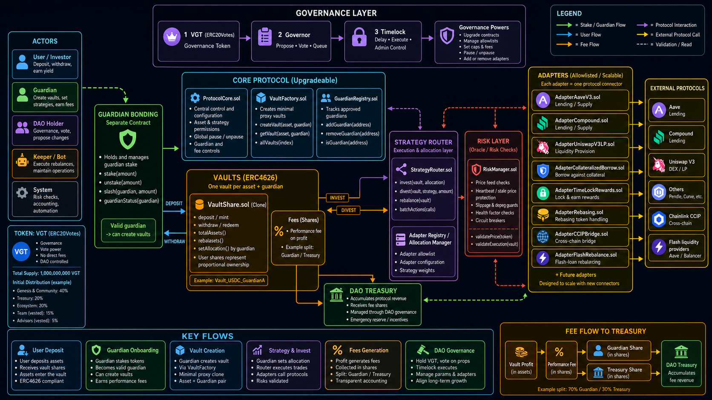

# Varios Governance & Vault Protocol

> Modular DeFi protocol with DAO governance, guardian-managed ERC4626 vaults, strategy routing, risk validation, treasury fee accounting, and scalable external protocol adapters.

## Project Status

This repository is currently in an advanced development stage. The architecture is already modular and protocol-oriented, but before presenting it as production-ready the project should add a professional test suite, deployment invariants, integration tests, fuzz/invariant tests, and fork tests for real external protocol adapters.

Current evaluation from review:

- **Architecture:** strong and modular.
- **Testing:** still pending; this is the main gap.
- **Deployment:** functional structure exists, but several post-deploy assumptions must be validated by tests.
- **Security model:** promising, but needs formalization through tests, documentation, and threat modeling.
- **Frontend:** the project includes/targets a frontend, so generated ABIs, addresses, seeded local state, and demo flows should be treated as part of the professional delivery.

## High-Level Architecture



The protocol is organized into the following layers:

1. **Governance Layer**
   - `GovernanceToken.sol`
   - `DaoGovernor.sol`
   - `TimeLock.sol`

2. **Bootstrap / Treasury Layer**
   - `GenesisBonding.sol`
   - `Treasury.sol`

3. **Core Protocol Layer**
   - `ProtocolCore.sol`
   - central configuration, supported assets, pause controls, genesis token tracking, and protocol-level permissions.

4. **Guardian Layer**
   - `GuardianAdministrator.sol`
   - `GuardianBondEscrow.sol`
   - guardian application, bond locking, approval, rejection, resignation, banning, slashing.

5. **Vault Layer**
   - `VaultFactory.sol`
   - `VaultRegistry.sol`
   - `VaultImplementation.sol`
   - ERC4626 vault clones deployed per asset and guardian.

6. **Execution / Risk Layer**
   - `StrategyRouter.sol`
   - `RiskManager.sol`
   - risk validation, oracle checks, adapter allowlisting, strategy execution.

7. **Adapter Layer**
   - `AaveV3Adapter.sol`
   - `CompoundV3Adapter.sol`
   - designed to scale to more adapters such as Uniswap V3 LP, Pendle, Curve, bridge adapters, rebasing adapters, collateralized borrowing adapters, and flash rebalance adapters.

## Core Idea

The protocol allows approved guardians to create asset-specific ERC4626 vaults. Users deposit assets into vaults and receive shares. Guardians manage allocation strategies through a strategy router. Before execution, risk checks validate price feeds, heartbeats, stale prices, depeg bounds, and execution safety. Fees are collected in shares and directed between guardians and the DAO treasury. Governance controls configuration, permissions, upgrades, allowlists, caps, and emergency actions through a timelock.

## Main User Roles

| Actor | Purpose |
|---|---|
| User / Investor | Deposits assets into vaults, receives vault shares, withdraws assets, earns yield. |
| Guardian | Stakes/bonds, becomes approved, creates vaults, manages strategies, earns performance fees. |
| DAO Holder | Holds VGT, votes, proposes governance changes. |
| Keeper / Bot | Executes rebalances and operational maintenance. |
| System / Protocol | Handles risk checks, accounting, pause logic, and adapter validations. |

## Main Business Flows

### 1. Governance Setup

VGT holders vote through `DaoGovernor`. Approved proposals are queued and executed through `TimeLock`. Governance can manage protocol configuration, pause/unpause flows, add/remove adapters, update caps and fees, and administer critical roles.

### 2. Genesis Bonding

Users acquire governance tokens through `GenesisBonding` using allowed purchase tokens. Payment assets are sent to `Treasury`, and `GovernanceToken` is minted to buyers until minting is finalized.

### 3. Guardian Onboarding

A guardian locks stake through `GuardianBondEscrow`, applies through `GuardianAdministrator`, and becomes active after DAO/timelock approval. Active guardians can create vaults and manage strategies.

### 4. Vault Creation

An active guardian calls `VaultFactory.createVault(asset, guardian)`. The factory deploys a minimal proxy clone of `VaultImplementation`, initializes it, and registers it in `VaultRegistry`.

### 5. Strategy Execution

A guardian configures vault allocation. `VaultImplementation` interacts with `StrategyRouter`, which validates execution through `RiskManager` and calls allowlisted adapters. Adapters connect vault capital to external protocols such as Aave, Compound, Uniswap V3, or future integrations.

### 6. Fee Flow

Vault profit generates performance fees in shares. Fee shares are split between guardian and treasury according to protocol configuration. The DAO treasury accumulates protocol revenue and can deploy it through governance.

## Repository Areas Reviewed

```text
contracts/
  adapters/
  bootstrap/
  core/
  execution/
  governance/
  guardians/
  interfaces/
  libraries/
  vaults/

script/
  deploy/
  local/
  contracts.config.ts
  generate-abis.ts
  generate-addresses.ts
  generate-contracts-sdk.ts
  generate-helpers.ts

test/
  Unit/
  mocks/
  interfaces/
```

## Recommended Documentation Set

This package contains the suggested documentation files:

- `README.md`
- `ARCHITECTURE.md`
- `TESTING_STRATEGY.md`
- `SECURITY_MODEL.md`
- `DEPLOYMENT.md`
- `KNOWN_ISSUES.md`
- `assets/architecture-overview.png`

## Frontend Considerations

Because the project also has a frontend, the frontend should be treated as part of the delivery quality:

- deployment addresses should be generated deterministically per network;
- ABIs should be exported through a repeatable script;
- local Anvil seed should create demo users, guardians, vaults, proposals, token balances, and vault deposits;
- frontend should distinguish between base deployment and locally seeded deployment;
- UI should expose protocol states clearly: paused, asset unsupported, guardian inactive, adapter not allowed, risk check failing, oracle stale, vault inactive.

The scripts `generate-abis.ts`, `generate-addresses.ts`, `generate-contracts-sdk.ts`, and `generate-helpers.ts` are useful for keeping frontend integration synchronized with the contracts.
